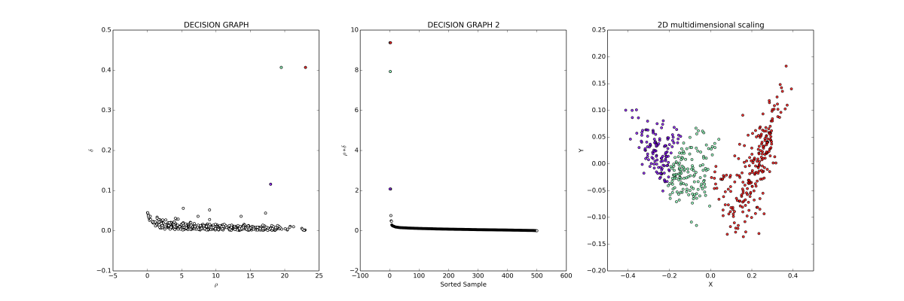
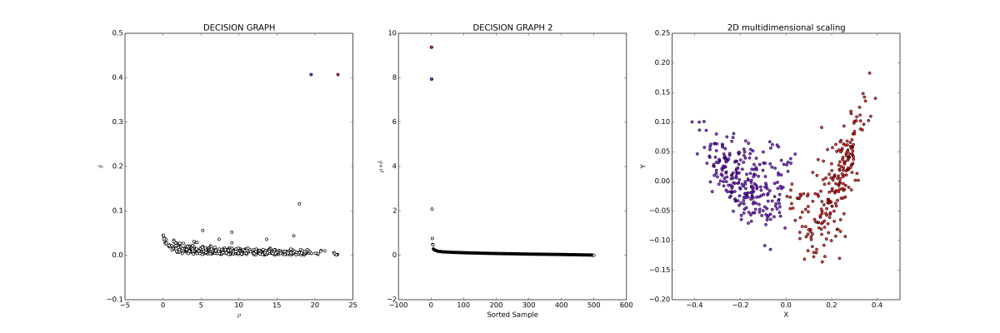

Clustering by fast search and find of density peaks
===================================================
This Python package implements the clustering algorithm  proposed by Alex Rodriguez and Alessandro Laio. It generates the initial rho and delta values for each observation then use these values to assign observations to clusters.

Installation
------------
This version is for both python2 and python3.
The first step is to install Python. Python is available from the `Python project page <https://www.python.org/>`_ . The next step is install sharepathway.

Install from PyPi using `pip <http://www.pip-installer.org/en/latest/>`_, a
package manager for Python::

    $ pip install Dcluster

Or, you can download the source code at `Github <https://github.com/GuipengLi/Dcluster>`_  or at `PyPi <https://pypi.python.org/pypi/Dcluster>`_ for Dcluster, and then run::

    $ python setup.py install

Usage
-----
The only input is the distance metrics between observations. See the test.dat. Dcluster supports interacive clustering based on Decision Graph::

    import Dcluster as dcl
    filein="test.dat"
    dcl.run(fi=filein)

Test data
---------
See the test.dat in test/. One can choose different cluster centers based on Decision Graph.

Contact
-------
Author: Guipeng Li

Email:  guipeng.lee@gmail.com

Refences
--------
Rodriguez, A., & Laio, A. (2014). Clustering by fast search and find of density peaks. Science, 344(6191), 1492-1496. (`paper <http://www.sciencemag.org/content/344/6191/1492.full>`_)
